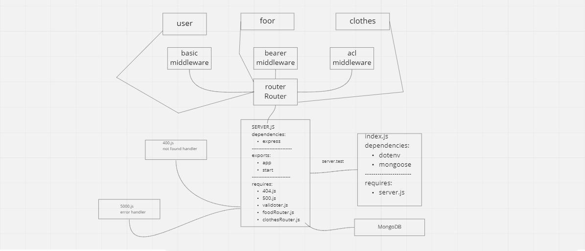

# auth-api

Description

In this final phase, the new requirement is to extend the restrictive capabilities of our routes to our API, implementing a fully functional, authenticated and authorized API Server using the latest coding techniques

Specifically, we want to make the following restrictions:

Regular users can READ
Writers can READ and CREATE
Editors can READ, CREATE, and UPDATE
Administrators can READ, CREATE, UPDATE, and DELETE

Restrict access without a valid token AND a specific capability.

Create a new set of routes (V2) within the server
V2 API Routes (/api/v2/...) must now be protected with the proper permissions based on user capability, using Bearer Authentication and an ACL
app.get(...) should require authentication only, no specific roles
app.post(...) should require both a bearer token and the create capability
app.put(...) should require both a bearer token and the update capability
app.patch(...) should require both a bearer token and the update capability
app.delete(...) should require both a bearer token and the delete capability

Links
Heroku Link: [https://auth-api-amro.herokuapp.com/](https://auth-api-amro.herokuapp.com/)

Github Actions: [https://github.com/amroalbarham/auth-api/actions](https://github.com/amroalbarham/auth-api/actions)

Pull Request: [https://github.com/amroalbarham/auth-api/pull/3](https://github.com/amroalbarham/auth-api/pull/3)

UML

